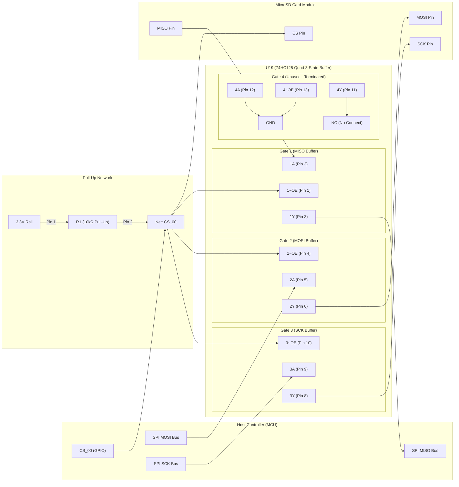

# MicroSD SPI Bus Isolation Architecture & Wiring Specification

## 1. Overview & Problem Statement

When multiple SPI peripherals share a single SPI bus (Clock, MOSI, MISO), all inactive slave devices must release the **MISO (Master In Slave Out)** line by putting their data output pin into a **High-Impedance (Hi-Z)** state whenever their Chip Select (`CS`) line is unasserted (HIGH).

Many commercial MicroSD card breakout modules and certain SD cards fail to properly release or tri-state the MISO line when deselected, causing bus contention, corrupted reads, and communication failures with other SPI devices on the bus.

To resolve this, a **74HC125 Quad 3-State Buffer (`U19`)** is used as a bus gatekeeper. It completely isolates the MicroSD card from the shared SPI bus whenever `CS_00` is inactive.

---

## 2. Theory of Operation

The **74HC125** contains four independent buffer gates with **active-low Output Enable ($\overline{\text{OE}}$)** inputs:
* When $\overline{\text{OE}}$ is **LOW (0V)**: The gate is **Enabled** ($Y = A$).
* When $\overline{\text{OE}}$ is **HIGH (3.3V)**: The gate output ($Y$) enters **High-Impedance (Hi-Z)** mode (electrically disconnected).

Because SPI Chip Select lines are also **Active-Low** (asserted when LOW), the MCU's `CS_00` line directly drives the $\overline{\text{OE}}$ inputs of the 74HC125 gates without needing inverter logic.

### State Truth Table

| MCU `CS_00` State | MicroSD CS | 74HC125 $\overline{\text{OE}}$ (Pins 1, 4, 10) | MISO Buffer (Gate 1) | MOSI & SCK Buffers (Gates 2, 3) | Bus Status |
| :--- | :--- | :--- | :--- | :--- | :--- |
| **LOW (0V)** | Asserted (Active) | Active (LOW) | **Enabled** (SD MISO $\rightarrow$ MCU) | **Enabled** (MCU $\rightarrow$ SD) | MicroSD active on bus |
| **HIGH (3.3V)** | Inactive (Deselected)| Inactive (HIGH) | **Hi-Z / Disconnected** | **Hi-Z / Disconnected** | Bus free for other devices |

---

## 3. System Architecture Diagram



---

## 4. Hardware Pinout & Wiring Specification

### 74HC125 (`U19`) Pin Assignments

| Pin # | Symbol | Connected To | Net / Signal Name | Description |
| :---: | :--- | :--- | :--- | :--- |
| **1** | `1~OE` | MCU `CS_00` + R1 Pin 2 | `CS_00` | Output Enable for MISO Gate (Active-Low) |
| **2** | `1A` | MicroSD Module `MISO` | `SD_MISO` | Input: MISO signal from SD Card |
| **3** | `1Y` | MCU `MISO` Pin | `SPI_MISO` | Output: Drives system SPI MISO bus (Tri-stated when CS is HIGH) |
| **4** | `2~OE` | MCU `CS_00` + R1 Pin 2 | `CS_00` | Output Enable for MOSI Gate (Active-Low) |
| **5** | `2A` | MCU `MOSI` Pin | `SPI_MOSI` | Input: MOSI signal from MCU |
| **6** | `2Y` | MicroSD Module `MOSI` | `SD_MOSI` | Output: Drives SD Card MOSI line |
| **7** | `GND` | Ground Plane | `GND` | IC Ground |
| **8** | `3Y` | MicroSD Module `SCK` | `SD_SCK` | Output: Drives SD Card Clock line |
| **9** | `3A` | MCU `SCK` Pin | `SPI_SCK` | Input: SCK signal from MCU |
| **10** | `3~OE` | MCU `CS_00` + R1 Pin 2 | `CS_00` | Output Enable for SCK Gate (Active-Low) |
| **11** | `4Y` | *Unconnected* | `NC` | Unused Gate 4 Output (Leave open / No Connect) |
| **12** | `4A` | Ground Plane | `GND` | Unused Gate 4 Input (Tied to GND to prevent floating CMOS input) |
| **13** | `4~OE` | Ground Plane | `GND` | Unused Gate 4 Enable (Tied to GND) |
| **14** | `VCC` | 3.3V Power Rail | `+3V3` | IC Supply Voltage (placed adjacent to 100nF decoupling cap) |

---

## 5. Design Decisions & Implementation Notes

### 1. Direct CS Driving (Bypassing U19 Gate 4)
* **Rationale:** The `CS_00` line is dedicated to the MicroSD slot and is already clean logic. Driving the MicroSD CS pin directly from the MCU GPIO avoids unnecessary propagation delay through an extra buffer gate.
* **Result:** Gate 4 of U19 is freed and safely terminated.

### 2. Pull-Up Resistor (`R1`) Configuration
* **Value:** $10\text{ k}\Omega$ resistor.
* **Routing:** 
  * **Pin 1:** 3.3V Rail (`+3V3`).
  * **Pin 2:** `CS_00` Net.
* **Function:** Guarantees `CS_00` is pulled HIGH during MCU boot, reset, or when GPIOs are in high-impedance input mode, ensuring the SD card and 74HC125 remain in an isolated/tri-stated state until firmware explicitly takes control.

### 3. Termination of Unused CMOS Inputs
* **Rule:** High-speed CMOS inputs must never be left floating; floating inputs drift into intermediate voltage thresholds, causing excessive $I_{cc}$ supply current and spurious oscillations.
* **Implementation:** Pins 12 (`4A`) and 13 (`4~OE`) are tied directly to `GND`. Pin 11 (`4Y`) is left unconnected (`NC`).

### 4. Power & Decoupling
* A **100nF (0.1µF) ceramic capacitor** is placed immediately adjacent to Pin 14 (`VCC`) and Pin 7 (`GND`) of U19 to filter high-frequency switching transients on the SPI lines.

---

# 16-Channel SPI Chip Select (CS) Multiplexing Architecture

## 6. Overview & Multiplexing Strategy

To support up to 16 SPI slave devices (e.g. distributed sensor/worker modules, external peripherals) without exhausting MCU GPIOs, a **4-to-16 Active-Low Demultiplexer** is implemented using two cascaded **74HC138 3-to-8 Line Decoders/Demultiplexers**.

* **GPIO Efficiency:** Reduces pin count from 16 dedicated GPIOs down to **4 Address GPIOs** (`ADDR_0` to `ADDR_3`) plus **1 optional Master Strobe GPIO** (`!CS_EN`).
* **Active-Low Compatibility:** The 74HC138 naturally produces active-low outputs ($Y_0 \dots Y_7$), perfectly matching standard SPI `/CS` protocol logic without requiring inverters.
* **Mutual Exclusion:** Hardware decoding guarantees that only one slave device's CS line is asserted at any given moment, preventing multi-talker bus collisions.

---

## 7. Theory of Operation & Cascading Logic

Each 74HC138 decodes 3 binary address lines ($A, B, C$) into 8 mutually-exclusive active-low outputs when enabled:
$$\text{Output Selected (Active LOW) } \iff G1 = \text{HIGH} \;\land\; \overline{\text{G2A}} = \text{LOW} \;\land\; \overline{\text{G2B}} = \text{LOW}$$

By pairing the Active-Low Enable ($\overline{\text{G2A}}$) on Chip 1 with the Active-High Enable ($G1$) on Chip 2, the 4th address bit (`ADDR_3`) functions as a seamless hardware bank selector.

```mermaid
flowchart TD
    subgraph Host ["Host Controller (MCU)"]
        ADDR_0["ADDR_0 (LSB)"]
        ADDR_1["ADDR_1"]
        ADDR_2["ADDR_2"]
        ADDR_3["ADDR_3 (Bank Select)"]
        CS_STROBE["!CS_EN (Master Strobe)"]
    end

    subgraph Decoders ["Cascaded 74HC138 Demultiplexer Array"]
        subgraph IC1 ["IC1: 74HC138 (Lower Bank: CS_00 - CS_07)"]
            IC1_A["A (Pin 1)"]
            IC1_B["B (Pin 2)"]
            IC1_C["C (Pin 3)"]
            IC1_G2A["!G2A (Pin 4)"]
            IC1_G2B["!G2B (Pin 5)"]
            IC1_G1["G1 (Pin 6)"]
            IC1_OUT["Y0..Y7 (Active LOW)"]
        end

        subgraph IC2 ["IC2: 74HC138 (Upper Bank: CS_08 - CS_15)"]
            IC2_A["A (Pin 1)"]
            IC2_B["B (Pin 2)"]
            IC2_C["C (Pin 3)"]
            IC2_G2A["!G2A (Pin 4)"]
            IC2_G2B["!G2B (Pin 5)"]
            IC2_G1["G1 (Pin 6)"]
            IC2_OUT["Y0..Y7 (Active LOW)"]
        end
    end

    %% Address bus distribution
    ADDR_0 --> IC1_A & IC2_A
    ADDR_1 --> IC1_B & IC2_B
    ADDR_2 --> IC1_C & IC2_C

    %% Bank selection via ADDR_3
    ADDR_3 -->|Active LOW enables IC1| IC1_G2A
    ADDR_3 -->|Active HIGH enables IC2| IC2_G1

    %% Master CS Strobe
    CS_STROBE --> IC1_G2B & IC2_G2A

    %% Tied pins
    VCC_PULL["+3.3V Rail"] --> IC1_G1
    GND_PULL["GND Plane"] --> IC2_G2B

    %% Outputs
    IC1_OUT --> CS_BANK0["Outputs: /CS_00 to /CS_07"]
    IC2_OUT --> CS_BANK1["Outputs: /CS_08 to /CS_15"]
```



---

## 8. Addressing & Truth Table

| Decimal Channel | ADDR_3 | ADDR_2 | ADDR_1 | ADDR_0 | Active Chip | Asserted Output Line | Function |
| :---: | :---: | :---: | :---: | :---: | :---: | :---: | :--- |
| **0** | `0` | `0` | `0` | `0` | **IC1** | `IC1: Y0` | `/CS_00` (e.g. MicroSD Gate) |
| **1** | `0` | `0` | `0` | `1` | **IC1** | `IC1: Y1` | `/CS_01` (Worker 1 / Sensor) |
| **2** | `0` | `0` | `1` | `0` | **IC1** | `IC1: Y2` | `/CS_02` (Worker 2 / Sensor) |
| **3** | `0` | `0` | `1` | `1` | **IC1** | `IC1: Y3` | `/CS_03` (Worker 3 / Sensor) |
| **4–7** | `0` | `1` | `X` | `X` | **IC1** | `IC1: Y4..Y7` | `/CS_04` – `/CS_07` |
| **8** | `1` | `0` | `0` | `0` | **IC2** | `IC2: Y0` | `/CS_08` |
| **9** | `1` | `0` | `0` | `1` | **IC2** | `IC2: Y1` | `/CS_09` |
| **10–14** | `1` | `X` | `X` | `X` | **IC2** | `IC2: Y2..Y6` | `/CS_10` – `/CS_14` |
| **15** | `1` | `1` | `1` | `1` | **IC2** | `IC2: Y7` | `/CS_15` |
| **ALL OFF** | `X` | `X` | `X` | `X` | **None** (`!CS_EN` = HIGH) | None (All HIGH) | Bus Idle / Deselected |

---

## 9. Complete Hardware Wiring & Pin Assignment

### Decoder 1 & 2 Pin Connections (74HC138 DIP-16 / SOIC-16)

| Pin # | Pin Symbol | Pin Function | Chip 1 (Lower Bank 0–7) | Chip 2 (Upper Bank 8–15) |
| :---: | :---: | :--- | :--- | :--- |
| **1** | `A` | Address Bit 0 (LSB) | `ADDR_0` (MCU GPIO) | `ADDR_0` (MCU GPIO) |
| **2** | `B` | Address Bit 1 | `ADDR_1` (MCU GPIO) | `ADDR_1` (MCU GPIO) |
| **3** | `C` | Address Bit 2 | `ADDR_2` (MCU GPIO) | `ADDR_2` (MCU GPIO) |
| **4** | `!G2A` | Active-LOW Enable A | `ADDR_3` (Bank Select) | `!CS_EN` *(or GND if unused)* |
| **5** | `!G2B` | Active-LOW Enable B | `!CS_EN` *(or GND if unused)* | `GND` |
| **6** | `G1` | Active-HIGH Enable | `+3V3` | `ADDR_3` (Bank Select) |
| **7** | `Y7` | Inverted Output 7 | Net `/CS_07` | Net `/CS_15` |
| **8** | `GND` | Power Ground | `GND` | `GND` |
| **9** | `Y6` | Inverted Output 6 | Net `/CS_06` | Net `/CS_14` |
| **10** | `Y5` | Inverted Output 5 | Net `/CS_05` | Net `/CS_13` |
| **11** | `Y4` | Inverted Output 4 | Net `/CS_04` | Net `/CS_12` |
| **12** | `Y3` | Inverted Output 3 | Net `/CS_03` | Net `/CS_11` |
| **13** | `Y2` | Inverted Output 2 | Net `/CS_02` | Net `/CS_10` |
| **14** | `Y1` | Inverted Output 1 | Net `/CS_01` | Net `/CS_09` |
| **15** | `Y0` | Inverted Output 0 | Net `/CS_00` | Net `/CS_08` |
| **16** | `VCC` | Supply Voltage | `+3V3` (with 100nF bypass cap) | `+3V3` (with 100nF bypass cap) |

---

## 10. Design Decisions & Glitch Prevention

### 1. Strobe-Gated Address Switching (`!CS_EN`)
* **Glitch Risk:** When transitioning between addresses (e.g., from `0011` to `0100`), GPIO skew can momentarily produce intermediate addresses (e.g., `0000` or `0111`), briefly glitching an unintended slave's CS line LOW.
* **Prevention Protocol:**
  1. Deassert master enable: Set `!CS_EN` = `HIGH` (forces all 16 outputs HIGH).
  2. Set address pins: Write `ADDR_0..3` to target peripheral.
  3. Assert master enable: Set `!CS_EN` = `LOW` to activate target CS line.
  4. Perform SPI transmission.
  5. Deassert master enable: Set `!CS_EN` = `HIGH` before changing address pins.

### 2. High-Speed Decoupling & Signal Integrity
* Each 74HC138 must have a **100nF ceramic decoupling capacitor** placed within 5mm of Pin 16 (`VCC`) and Pin 8 (`GND`).
* SPI CS lines are push-pull outputs from the 74HC138 and do not require external pull-up resistors unless long ribbon cables or hot-plugged modules introduce capacitive ringing.

### 3. Schematic ERC Compatibility
* If EDA software (e.g. KiCad) reports *"Input pin not driven by any Output pins"* on `A, B, C, !G2A, !G2B, G1`:
  * Ensure MCU GPIO pins in the symbol are designated as **Bidirectional** or **Output** (rather than Passive).
  * If driving via external breakout headers, place a **PWR_FLAG** or add an ERC exclusion rule for the header pins.

---

# Momentary Input Buttons Architecture & Wiring Specification

## 11. Overview & Pin Selection

With the 74HC138 CS multiplexer reclaiming 11 GPIO pins from the original direct-wired configuration, 4 dedicated, continuous GPIOs on the ESP32-S3 Controller (SPI Master Node) are allocated for momentary user-input buttons (e.g., UI navigation, display control, or mode switching).

### Selected Pins

| Button | Proposed Role (Example) | Controller Pin | Header Location (DevKitC-1) | Header Pin # | Electrical Characteristics |
| :---: | :--- | :---: | :--- | :---: | :--- |
| **SW1** | Button 1 (Up / Next) | **GPIO 39** | Right Header (`J3`) | Pin 9 | Standard Digital IO, Internal Pull-Up, Edge Interrupt |
| **SW2** | Button 2 (Down / Prev) | **GPIO 40** | Right Header (`J3`) | Pin 8 | Standard Digital IO, Internal Pull-Up, Edge Interrupt |
| **SW3** | Button 3 (Select / OK) | **GPIO 41** | Right Header (`J3`) | Pin 7 | Standard Digital IO, Internal Pull-Up, Edge Interrupt |
| **SW4** | Button 4 (Back / Cancel) | **GPIO 42** | Right Header (`J3`) | Pin 6 | Standard Digital IO, Internal Pull-Up, Edge Interrupt |

### Selection Rationale
1. **Physical Routing Adjacency:** On the ESP32-S3-DevKitC-1 footprint, pins 39 through 42 are consecutive on the right header rail (`J3`, pins 9 to 6), located immediately adjacent to GPIO 38 (SPI SCL on pin 10). This enables compact, parallel 4-lane PCB trace routing without vias or layer hopping.
2. **Boot / Strapping Immunity:** These pins have no boot-strapping behavior (avoiding strapping pins GPIO 0, 3, 45, 46). Holding or pressing buttons during boot or reset will never trigger ROM bootloader download modes.
3. **Memory Safety:** They do not conflict with internal SPI Flash or Octal PSRAM lines (GPIO 26–37).
4. **Peripheral Safety:** They do not conflict with native USB (`D-`/`D+` on GPIO 19, 20), UART0 console logging (GPIO 43, 44), GPS UART (GPIO 16, 17), or the SPI Master bus (GPIO 11, 13, 38).

---

## 12. Theory of Operation & Minimal Wiring

The buttons are implemented using an **Active-LOW direct-to-ground topology** (Minimal Configuration). 

### Electrical Configuration
* **No External Resistors or Capacitors:** The circuit relies entirely on the ESP32-S3 internal weak pull-up resistors ($\approx 45\text{ k}\Omega$).
* **Active-LOW Logic:** Pressing the momentary switch pulls the pin directly to `GND` (logic LOW / `0`). Releasing the switch allows the internal pull-up to restore the pin to `+3.3V` (logic HIGH / `1`).
* **Safety:** Keeping `+3.3V` power traces away from buttons and panel cutouts eliminates the risk of inadvertent short-to-ground faults.

### Schematic Diagram

```
 ESP32-S3 Controller (J3 Header)
 ┌───────────────────────────┐
 │                           │
 │ Pin 10: GPIO 38 (SCL)     │
 │                           │
 │ Pin  9: GPIO 39 (SW1)     ├───────────────┐
 │                           │               │
 │ Pin  8: GPIO 40 (SW2)     ├───────────┐   │
 │                           │           │   │
 │ Pin  7: GPIO 41 (SW3)     ├───────┐   │   │
 │                           │       │   │   │
 │ Pin  6: GPIO 42 (SW4)     ├───┐   │   │   │
 │                           │   │   │   │   │
 └───────────────────────────┘   │   │   │   │
                                 │   │   │   │
                        SW4      │   │   │   │
                       [ o/ o ]──┘   │   │   │
                          │          │   │   │
                        SW3          │   │   │
                       [ o/ o ]──────┘   │   │
                          │              │   │
                        SW2              │   │
                       [ o/ o ]──────────┘   │
                          │                  │
                        SW1                  │
                       [ o/ o ]──────────────┘
                          │
                         GND (Common Ground Plane)
```

### Tactile Button Footprint & PCB Routing Guidelines
* **4-Pin Tactile Switches (e.g. 6x6mm THT/SMD):** Pins 1 and 2 are internally shorted, and pins 3 and 4 are internally shorted. 
* **Anti-Rotation Rule:** Wire the **GPIO net to Pin 1** and the **GND net to Pin 4** (diagonally opposite pins). This guarantees proper operation even if the switch component is accidentally rotated 90 degrees during pick-and-place or hand assembly.
* **Ground Reference:** Connect the switch ground return directly to the ground plane pour rather than daisy-chaining a long return trace near the high-speed SPI lines.

---

## 13. Firmware Implementation & Software Debouncing

Because no hardware RC filter is used, switch debouncing is handled purely in software (ESP-IDF).

### ESP-IDF GPIO Configuration

```c
#include "driver/gpio.h"

#define BTN_1_GPIO  GPIO_NUM_39
#define BTN_2_GPIO  GPIO_NUM_40
#define BTN_3_GPIO  GPIO_NUM_41
#define BTN_4_GPIO  GPIO_NUM_42

#define BTN_PIN_MASK ((1ULL << BTN_1_GPIO) | \
                      (1ULL << BTN_2_GPIO) | \
                      (1ULL << BTN_3_GPIO) | \
                      (1ULL << BTN_4_GPIO))

void init_buttons(void) {
    gpio_config_t btn_cfg = {
        .pin_bit_mask = BTN_PIN_MASK,
        .mode = GPIO_MODE_INPUT,
        .pull_up_en = GPIO_PULLUP_ENABLE,     // Enable internal ~45kΩ pull-up
        .pull_down_en = GPIO_PULLDOWN_DISABLE,
        .intr_type = GPIO_INTR_ANYEDGE        // Or GPIO_INTR_NEGEDGE for press event
    };
    gpio_config(&btn_cfg);
}

// Logic readout:
// gpio_get_level(BTN_1_GPIO) == 0  --> Pressed (Active-LOW)
// gpio_get_level(BTN_1_GPIO) == 1  --> Released
```

### Debounce Handling
* **Polling Approach (Recommended):** Run a dedicated FreeRTOS task that polls the 4 GPIO levels every **15–20 ms**. A state change is only registered after two consecutive identical samples, eliminating mechanical contact bounce.
* **Interrupt Approach:** If using ISR callbacks (`GPIO_INTR_NEGEDGE`), record the timestamp using `esp_timer_get_time()` and discard any subsequent interrupts on that pin within a **20–30 ms** refractory window.


