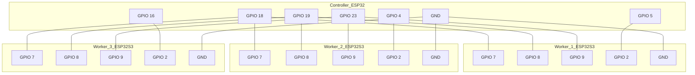

# SPI Communication Project Plan: ESP32 Controller to 3x ESP32-S3 Workers

This document outlines the architecture, hardware connections, and implementation strategy for establishing reliable SPI communication between one ESP32 (Controller) and three ESP32-S3 (Workers) using the ESP-IDF framework.

## 1. Project Overview
- **Controller:** ESP32-WROOM-32 (NodeMCU-32S style)
- **Workers:** 3x Seeed Studio ESP32-S3 (Xiao or similar)
- **Protocol:** SPI (Serial Peripheral Interface)
- **Goal:** Controller cycles through workers, verifies availability, and receives a large data payload (5000+ characters) with checksum validation.

---

## 2. Hardware Wiring Diagram

All devices must share a common **GND**. Power is provided independently via USB for each node.

### SPI Bus Connections (Common)
| Signal | ESP32 (Controller) | ESP32-S3 (Worker 1) | ESP32-S3 (Worker 2) | ESP32-S3 (Worker 3) |
| :--- | :--- | :--- | :--- | :--- |
| **SCLK** | GPIO 18 | GPIO 7 | GPIO 7 | GPIO 7 |
| **MISO** | GPIO 19 | GPIO 8 | GPIO 8 | GPIO 8 |
| **MOSI** | GPIO 23 | GPIO 9 | GPIO 9 | GPIO 9 |
| **GND** | GND | GND | GND | GND |

### Chip Select (CS) Connections (Unique)
| Target | ESP32 (Controller CS Pin) | ESP32-S3 (Worker CS Pin) |
| :--- | :--- | :--- |
| **Worker 1** | GPIO 5 | GPIO 2 |
| **Worker 2** | GPIO 4 | GPIO 2 |
| **Worker 3** | GPIO 16 | GPIO 2 |

---

## 3. SPI Configuration Strategy

- **SPI Mode:** Mode 0 (CPOL=0, CPHA=0) is standard and most stable.
- **Clock Speed:** 1 MHz (Conservative for long wires/breadboards).
- **DMA (Direct Memory Access):** Enabled on both sides to handle the 5000-character payload efficiently.
- **Queue Depth:** 7 (to allow for status and data transactions).

---

## 4. Implementation Phases

### Phase 1: Project Scaffolding
- Create `controller/` and `worker/` directories.
- Initialize ESP-IDF projects in each.
- Configure `sdkconfig` for both (DMA, SPI limits).

### Phase 2: Basic Handshake (Ping/Pong)
- **Controller:** Pull CS low, send a "WHO_ARE_YOU" byte, wait for "WORKER_X_READY" response.
- **Worker:** Wait for SPI transaction, respond with ID.
- Verify startup delay of 5 seconds.

### Phase 3: Large Payload Transmission
- **Worker:** Generate a 5000+ character dummy message (e.g., repeating ASCII pattern).
- **Checksum:** Calculate CRC32 or a simple 16-bit XOR checksum of the payload.
- **Transmission:** Send payload in a single DMA-backed transaction or chunked if buffer limits are hit (ESP32-S3 DMA supports up to 4092 bytes per descriptor, but ESP-IDF abstracts this).

### Phase 4: Controller Validation
- **Controller:** Receive payload into a large buffer.
- **Verification:** Recalculate checksum and compare with the received one.
- **Cycling:** Move to the next CS pin and repeat.

### Phase 5: Troubleshooting & Logging
- Monitor timing issues (latency between CS low and transaction start).
- Log transmission failures and retries.

---

## 5. Development Tasks

1. [ ] Setup Project Structure (ESP-IDF boilerplate).
2. [ ] Implement SPI Master Driver on Controller.
3. [ ] Implement SPI Slave Driver on Worker.
4. [ ] Implement 5-second startup delay.
5. [ ] Implement Worker cycling logic on Controller.
6. [ ] Implement Large Message Generation & Checksum on Worker.
7. [ ] Implement Reception & Verification on Controller.
8. [ ] Test and document results.
